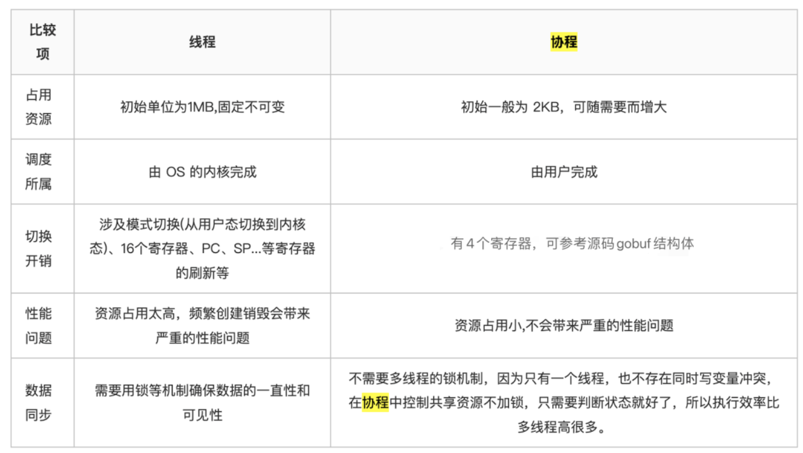

## Golang 中的并发含义
1. 让某函数独立于其他函数运行的能力。
2. 当一个函数创建为一个 goroutine 时，被 golang 视为一个独立的工作单元，这个工作单元会被调度到可用的逻辑处理器中执行

## 调度器 runtime
1. 是一个复杂的软件程序，能管理所有 goroutine 并为他们分配执行时间。
2. 在操作系统之上，将**操作系统的线程与语言运行时的逻辑处理器相绑定**，并在逻辑处理器上运行 goroutine 
3. 在调度器给定的任何时间都会全面控制哪个 goroutine 在哪个逻辑处理上运行

## CSP
1. 通信顺序进程 CSP 作为并发同步模型。CSP是一种消息传递模型。
2. 通过在 goroutine 之间传递数据来传递消息，而不是对数据进行加锁同步。同步和传递消息间传递的数据类型叫 channel

## 逻辑处理器与线程数
1. 调度器对可以创建的逻辑处理器数量没有限制
2. 但语言运行时默认限制每个程序最多10000个线程。
3. 这个限制值可以通过调用runtime/debug包的SetMaxThreads方法来更改。如果程序试图使用更多的线程，就会崩溃。

## 进程
1. 当一个程序执行时，操作系统会为这个程序创建一个进程。进程是一个包括了各种资源的容器，包括但不限于内存地址空间、文件和设备的句柄以及线程。

## 线程
1. 一个线程是一个执行空间，这个空间会被操作系统调度来运行函数中的代码
2. 每个进程的初始线程是一个主线程，当主线程终止时，这个进程也会终止
3. 操作系统会将进程调度到某个处理器上运行

## 协程与线程的区别

## 逻辑处理器
1. Golang 运行时会在逻辑处理器上调度 goroutine 来运行
2. 每个逻辑处理器都与一个操作系统线程绑定
3. 在 golang 1.5 之后会为每个可用的物理处理器分配一个逻辑处理器

## 本地运行队列
